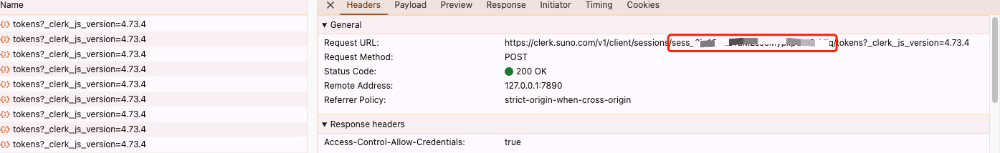
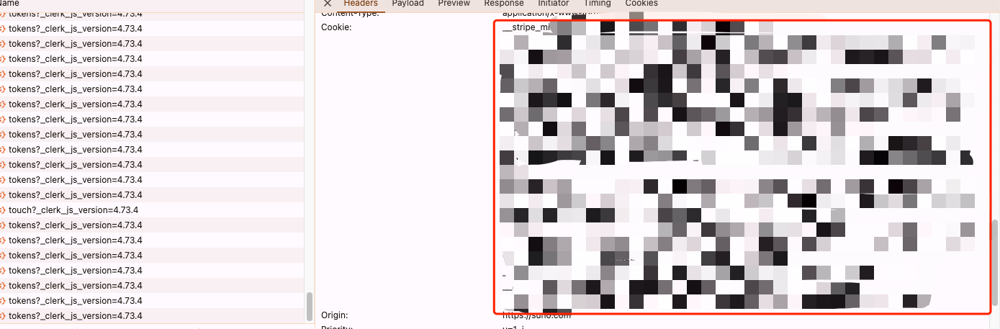

# SunoAPI
非suno 官方API，填写session id 和cookie后，自动维护登陆状态
unofficial SunoAPI , auto manage login status

see test.py


# how to get seesion_id 


# how to get cookie



# how to use
read api doc [SunoAPI](https://apifox.com/apidoc/shared-6611679a-5d3e-4939-b0a4-12086a0e52c6)

## run local
0. config `.env` in base dir 
```

DEBUG = true
LOG_LEVEL=DEBUG
TZ=Asia/Shanghai
LOG_TZ=Asia/Shanghai

SUNO_PORT=8000


SESSION_ID=
COOKIE="" # cookie 包含=，使用双引号包裹
```

1. run sh
```
sh run.sh
```

## run in  docker / docker compose
0.  config `.env` in docker dir
```
docker compose up -d
```


# todo
[x] 提示词音乐生成
[x] 歌词音乐生成
[x] 获取音乐
[x] 实现歌词生成
[x] 获取歌词
[] 音乐文件上传
[] 实现自动状态管理
[] 实现...(看到别的api有，但是每测，不知道咋写)
